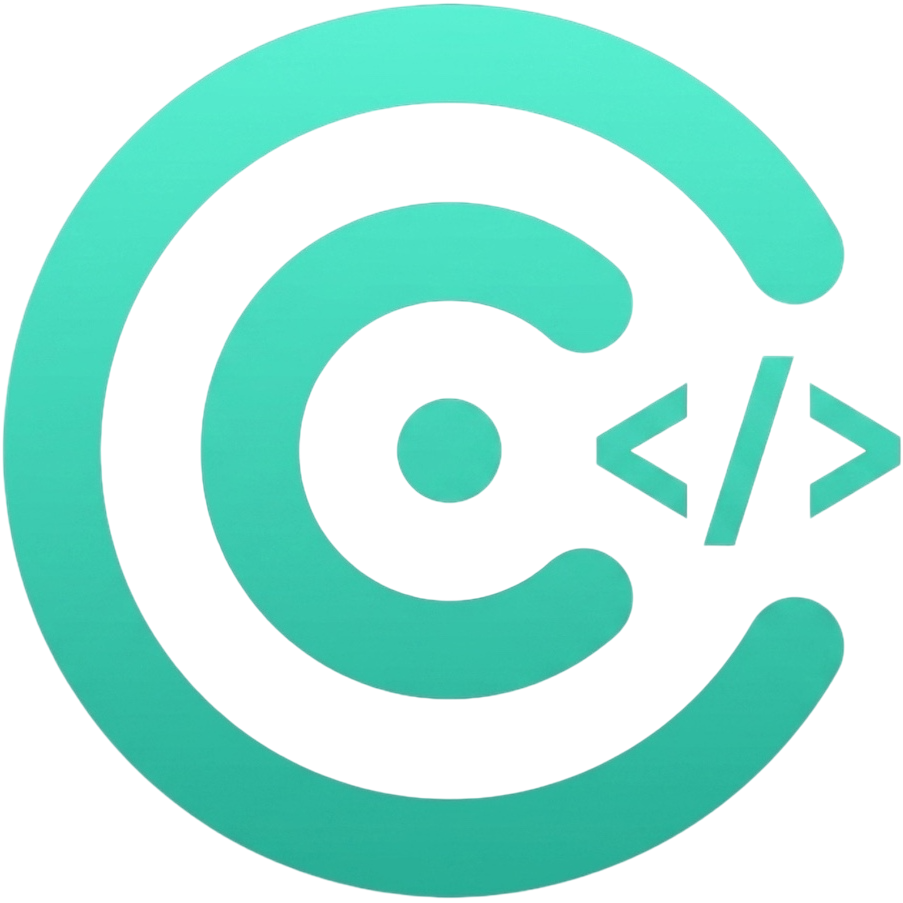

<div align="center">



# Workspace

**One native macOS window for all your repositories.**

Your projects and their pull requests, diffs you can comment on, an editor with
language servers, and a real terminal running Claude Code — side by side, in one
place, on one theme.

[Download](https://github.com/necessarylion/workspace/releases/latest) ·
[Features](#features) · [Shortcuts](#keyboard) · [Contributing](#contributing) ·
[License](#license)

</div>

---

```
┌──────────────┬────────────────────────────────┬──────────────────┐
│           >_ │  ‹ ›  breadcrumb          ✕    │Files│±│>_│✳│Info│
│              ├────────────────────────────────┼──────────────────┤
│ repo card    │                                │ file tree        │
│  branch ↑↓   │  one viewer:                   │ changes          │
│  2 PR clean  │  dashboard · file · diff · PR  │ terminals        │
│              │                                │ claude           │
│              │                                │ ports, open in…  │
│ + Add Repo   ├────────────────────────────────┤                  │
│              │ Ln 12, Col 4  Swift  ⚠2  sourcekit-lsp running    │
└──────────────┴────────────────────────────────┴──────────────────┘
```

**Left** — your repositories, each card showing branch, ahead/behind, open PRs and
changed files. **Centre** — exactly one thing at a time, with browser-style
back/forward. **Right** — files, changes, terminals, Claude conversations and info
for the repo you picked. No scrollbars anywhere.

## Install

1. Download `Workspace.dmg` from the
   [latest release](https://github.com/necessarylion/workspace/releases/latest).
2. Open it and drag **Workspace** onto Applications.
3. The app is signed ad-hoc, not with a paid Apple Developer account, so macOS
   warns on first launch. Clear the flag once:

   ```sh
   xattr -dr com.apple.quarantine /Applications/Workspace.app
   ```

   (Or right-click the app → **Open**, then **Open Anyway** in Privacy & Security.)

From then on the app **updates itself** from its own releases — check and download
in the background, relaunch when you say so.

### What you need

macOS 14 or newer, plus whichever of these you actually use:

| Tool | For |
| --- | --- |
| [`gh`](https://cli.github.com) | GitHub pull requests |
| [`bkt`](https://github.com/avivsinai/bitbucket-cli) | Bitbucket pull requests |
| [`claude`](https://claude.com/claude-code) | the Claude Code conversations |
| [`rg`](https://github.com/BurntSushi/ripgrep) | fast search inside files (`git grep` stands in) |

**Settings (⌘,) checks all of them for you** and installs or signs in to the
missing ones, so you never have to work out which command it wanted.

## Features

### Repositories

| Feature | What it does |
| --- | --- |
| Any folder, any host | GitHub, Bitbucket Cloud and Data Center, detected from `origin`. SSH aliases included. |
| Start or clone one | ⌘N makes an empty repository; ⇧⌘N clones from an SSH or HTTPS URL. Either lands in the sidebar. |
| Sidebar that stays true | Branch, ahead/behind, open PRs and changed files, re-read every five minutes. |
| Back to the default branch | The dashboard asks GitHub or Bitbucket which branch is the default — `main`, `develop`, `master` — and one button checks it out. |
| Pull, next to it | The button beside it brings the branch you are on up to date. Plain `git pull` — whatever the repository configures is what runs. |
| Your order | Drag cards to reorder, filter by name or path, fold it away with ⌘0. |
| Several GitHub accounts | Each repo uses its own `gh` account. Nothing global is switched. |
| Ports and Open in… | Live ports for the folder, and one click to VS Code, Cursor, Zed, Finder or Terminal. |

### Pull requests

| Feature | What it does |
| --- | --- |
| The board | Open PRs as a table: title, age, activity, reviewers, CI — one row each. |
| Read it all | Details, Diff and Commits tabs. Markdown, images and mentions rendered properly. |
| Threads | Replies nested under what they answer, every author in a colour of their own. |
| Write back | Comment, reply, edit the description, approve, request changes, merge, reject. |
| Reviewers | See who approved, add more from a searchable list of the people who can be asked. |
| `@` anyone | Type `@` in any comment box and pick a name from the repo. |
| Builds beside you | CI runs for the head commit in a side panel, failures first. |
| Update from main | One button when the branch has fallen behind. |

### Code and diffs

| Feature | What it does |
| --- | --- |
| Diffs worth reading | Side-by-side or unified, syntax coloured, with the changed words picked out. |
| Comment on a line | Hover the gutter, hit **+** — a new thread right there, on both hosts. |
| Changes tab | Stage, unstage, discard, commit and push without leaving the window. |
| Merge conflicts | Their own group, marked resolved one by one, and no commit while markers remain. |
| Commit message by Claude | One button writes it from what you staged, in your repo's style. |
| History | Recent commits grouped by day; click one for its patch, `#123` opens that PR. |

### Editor

| Feature | What it does |
| --- | --- |
| Real editing | Tree-sitter colours, folding, multiple cursors, find and replace (⌘F), auto-indent. |
| Language servers | Diagnostics, completions (⌃Space) and ⌘-click to definition for 20+ languages. |
| Go to file (⌘P) | `item controller` finds `app/controllers/item_controller.rb`. Punctuation optional. |
| Search in files | ripgrep, grouped by file, every hit marked in the file you open. |
| A file tree you can use | Drag in and out, copy and paste with Finder, rename in place, duplicate, multi-select, new file or folder. |

### Previews

| Feature | What it does |
| --- | --- |
| Markdown | Rendered, not raw — tables, task lists, code chips, and the pictures a README keeps beside itself — and saved as PDF with ⇧⌘E. |
| Mermaid | ` ```mermaid ` fences drawn as diagrams. |
| draw.io | `.drawio` files drawn as the diagram, with pages, zoom and layers. |
| PDF | Read page by page, with a floating page and zoom bar. |
| Offline | Every renderer ships inside the app. Nothing is fetched at runtime. |

### Terminal and Claude Code

| Feature | What it does |
| --- | --- |
| A real terminal | The Ghostty engine, rooted at the repo. As many shells as you like. |
| Ask Claude (⇧⌘L) | The real Claude Code CLI in a tab — every flag, slash command and plugin works. |
| Many at once | Conversations run side by side, each named after what it is about. |
| Resume anything | Past conversations listed from disk — including ones you started in your own shell. |
| It tells you | A Notification Centre banner when a shell wants you back; click it to land on that tab. |
| Home shells | Terminals that belong to no repository (⇧⌘T). |
| Drop to type | Drop a file on the terminal and its path lands at the prompt. |

### Looks

| Feature | What it does |
| --- | --- |
| Four themes | Adonis Eclipse, GitHub Dark, Atom One Dark, Dark+ — editor, diff and terminal alike. |
| One palette | All sixteen ANSI colours come from the theme, so `git diff` matches the code above it. |
| One font | Your monospaced face across the app, with its own sizes and line spacing. |
| Bring your own | `Scripts/import-vscode-theme.swift` ports any VS Code theme. |
| Your keys | Every shortcut the app binds is rebindable in Settings → Shortcuts, or removable. |

## Keyboard

The keys below are what the app ships with. **Every one of them is yours to
change** — Settings (⌘,) → Shortcuts records a new key for any command, or
takes its key away entirely. The rows the app does not own (⌘F, ⌃Space and
everything macOS binds) are not on offer there.

| Shortcut | Action |
| --- | --- |
| ⌘, | Settings — theme and font, shortcuts, required tools, language servers, updates |
| ⇧⌘O | Add repository |
| ⌘, | Settings — theme and font, required tools, language servers, updates |
| ⌘N / ⇧⌘N | New empty repository · clone one from a URL |
| ⇧⌘O | Add a repository folder you already have |
| ⌘P | Go to file |
| ⌘F | Find in the file |
| ⌘S | Save the file — or the PR description — you are editing |
| ⇧⌘E | Save the Markdown preview as a PDF |
| ⌘[ / ⌘] | Back / forward |
| ⎋ / ⇧⌘W | Close what is open |
| ⌘0 / ⌥⌘0 | Toggle the repositories / navigator sidebar |
| ⌃⇥ | Switch repository |
| ⌘R | Refresh all repositories |
| ⇧⌘L | Ask Claude about the selected repo |
| ⌃⌘T / ⌘T / ⇧⌘T | Repo terminal · new tab · home terminal |
| ⌃` | Show the repo's terminal, and the same key to leave it |
| ⌃⌘P | Create PR with Claude Code |
| ⌃Space | Completions |
| ⌘-click | Go to definition · in the file tree, add a row to the selection |
| ⌘↩ | Post the comment you typed · commit the staged files |
| ⏎ / ⌘⌫ | File tree: rename in place · move to Trash |
| ⌘C / ⌘V | File tree: copy the picked files · paste files copied in Finder |

## Thanks

Workspace is mostly other people's excellent work, joined together:

- **[CodeEditSourceEditor](https://github.com/CodeEditApp/CodeEditSourceEditor)**
  and **[CodeEditLanguages](https://github.com/CodeEditApp/CodeEditLanguages)** by
  the [CodeEdit](https://github.com/CodeEditApp) team — the editor, its gutter,
  its highlighting and its find panel.
- **[Ghostty](https://github.com/ghostty-org/ghostty)** by Mitchell Hashimoto and
  its contributors — the terminal engine, embedded as libghostty, packaged for
  SwiftPM by [Lakr233](https://github.com/Lakr233/libghostty-spm).
- **[tree-sitter](https://github.com/tree-sitter/tree-sitter)** by Max Brunsfeld
  and every grammar author — the syntax colours everywhere in the app.
- **[mermaid](https://github.com/mermaid-js/mermaid)** by Knut Sveidqvist and
  contributors — the diagrams in Markdown.
- **[draw.io](https://github.com/jgraph/drawio)** by JGraph — the `.drawio` viewer.
- **[ripgrep](https://github.com/BurntSushi/ripgrep)** by Andrew Gallant — the
  search inside files.
- **[GitHub CLI](https://github.com/cli/cli)** and
  **[bkt](https://github.com/avivsinai/bitbucket-cli)** — how the hosts are asked.
- **[Claude Code](https://claude.com/claude-code)** by Anthropic — the thing in the
  terminal, and a fair share of this app's own code.

## Contributing

Pull requests are welcome — bug fixes, new features, themes, or just better
wording.

**Build and run:**

```sh
git clone https://github.com/necessarylion/workspace.git
cd workspace
Scripts/run.sh          # build, wrap in Workspace.app, launch
```

A bare clone builds with nothing installed beyond Xcode 16+. `swift build` does
**not** work — a dependency ships an asset catalog only `xcodebuild` can compile,
so use the scripts (or open `Package.swift` in Xcode).

```sh
Scripts/bundle.sh       # build + bundle only, prints the .app path
Scripts/install.sh      # build Release and install to /Applications
Scripts/make-icon.sh    # rebuild Resources/AppIcon.icns from Assets/icon.png
```

**How to land a change:**

1. Branch off `main` and keep the change to one thing.
2. Match the code around you — Swift 6, SwiftUI first, AppKit where it has to be.
   Run every external tool through `Support/Shell.swift`.
3. Anything touching pull requests has to work on **both GitHub and Bitbucket**.
4. Check it builds (`Scripts/bundle.sh`) and run the app on a real repo before
   opening the PR — there is no test target.
5. Update the feature list here if you added something a user can see.
6. Open the PR against `main` and say what you changed and how you tried it.

Background reading lives in [`Docs/`](Docs/) — [Development.md](Docs/Development.md)
for how the project is built and released, [LSP.md](Docs/LSP.md) for the language
server layer, [Terminal.md](Docs/Terminal.md) for the terminal.

Found a bug or want something?
[Open an issue](https://github.com/necessarylion/workspace/issues) — screenshots
and the repo host involved help a lot.

## License

Workspace is released under the [MIT License](LICENSE) — use it, change it, ship
it, as long as the copyright notice comes along.
